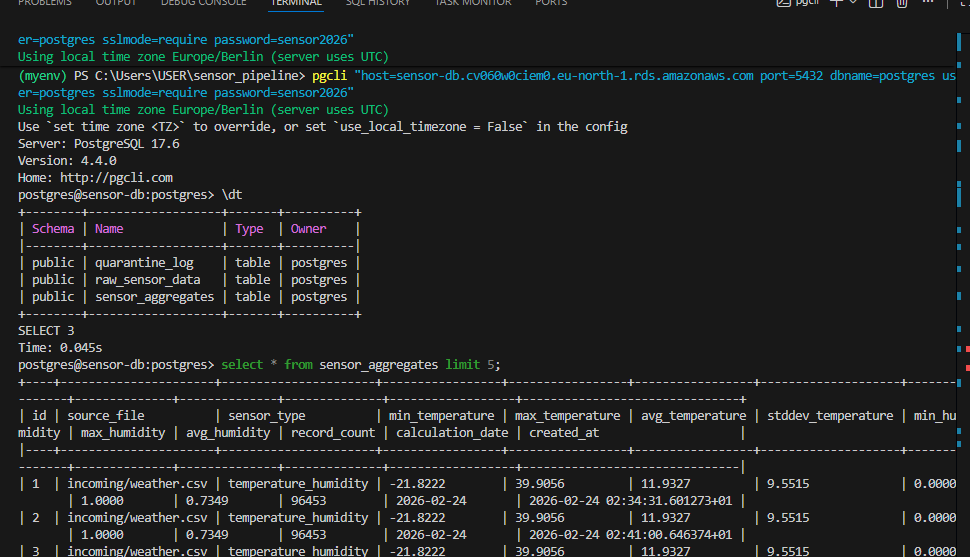
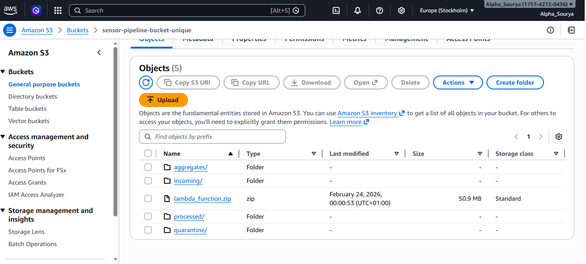

# 🌦 Weather Sensor Pipeline on AWS

A fully automated, serverless data engineering pipeline built on AWS to
process weather sensor CSV files in real time.

This project monitors an Amazon S3 bucket for incoming files, validates
and transforms data using AWS Lambda, calculates statistical aggregates,
stores processed data in PostgreSQL (Amazon RDS), and sends
notifications via Amazon SQS.

Designed to be scalable, fault-tolerant, and production-ready.

------------------------------------------------------------------------

# 📌 Project Overview

The Weather Sensor Pipeline demonstrates a cloud-native data processing
system capable of:

-   Real-time file ingestion
-   Data validation and quarantine handling
-   Data transformation and normalization
-   Statistical aggregation
-   Reliable database storage
-   Monitoring and logging
-   Fault tolerance with retry mechanisms
-   Serverless scalability

------------------------------------------------------------------------

# 🏗 Architecture

## Data Flow

Local Upload → S3 (incoming/) → Lambda Processing →\
RDS Storage + S3 Aggregates + SQS Notification → Archive (processed/)

## AWS Services Used

  Service                   Purpose
  ------------------------- -----------------------------
  Amazon S3                 File storage and ingestion
  AWS Lambda                Serverless data processing
  Amazon RDS (PostgreSQL)   Persistent data storage
  Amazon SQS                Success/error notifications
  Amazon CloudWatch         Logging and monitoring
  VPC + Endpoints           Secure networking

------------------------------------------------------------------------

# 📁 Repository Structure

Weather_Sensor_Pipeline_AWS/ ├── README.md ├── requirements.txt ├──
.gitignore ├── schema.sql ├── lambda_function.py ├── file_watcher.py ├──
Projectflow.txt ├── log_events.txt ├── files_sensor_pipeline.PNG ├──
data/ └── lambda_package/

------------------------------------------------------------------------

# 🔧 Technology Stack

-   Cloud Platform: AWS
-   Language: Python 3.12
-   Compute: AWS Lambda
-   Storage: Amazon S3
-   Database: PostgreSQL (Amazon RDS)
-   Messaging: Amazon SQS
-   Monitoring: CloudWatch
-   Libraries: pandas, psycopg2

------------------------------------------------------------------------

# 🗄 Database Schema

Three PostgreSQL tables are implemented:

1.  raw_sensor_data -- Stores validated sensor readings\
2.  sensor_aggregates -- Stores per-file statistics\
3.  quarantine_log -- Stores invalid rows with error details

   

------------------------------------------------------------------------

# 🔄 Data Processing Workflow

1.  File uploaded to S3 incoming/
2.  Lambda triggered automatically
3.  Data validated (range, format, null checks)
4.  Invalid data moved to quarantine/
5.  Valid data transformed and stored in RDS
6.  Aggregates calculated and saved
7.  File archived to processed/
8.  Notification sent via SQS

------------------------------------------------------------------------

# 📊 Performance Metrics

Test File: weather.csv (\~96,453 rows)

-   Processing Time: \~2.5 minutes
-   Memory Usage: \~468 MB
-   Valid Rows: 96,453
-   Aggregates Generated: 1

------------------------------------------------------------------------

# 🛡 Fault Tolerance

-   Exponential retry logic
-   Error logging in CloudWatch
-   Quarantine mechanism for bad data
-   Safe Lambda timeout handling

------------------------------------------------------------------------

# ⚙ Setup Instructions

## Local Setup

git clone https://github.com/Sourya2000/Weather_Sensor_Pipeline_AWS.git\
cd Weather_Sensor_Pipeline_AWS\
pip install -r requirements.txt\
python file_watcher.py

------------------------------------------------------------------------

# 🎯 Conclusion

This project demonstrates a scalable, production-ready serverless data
engineering pipeline built using AWS best practices.

------------------------------------------------------------------------

Author: Sourya2000\
Date: February 24, 2026
